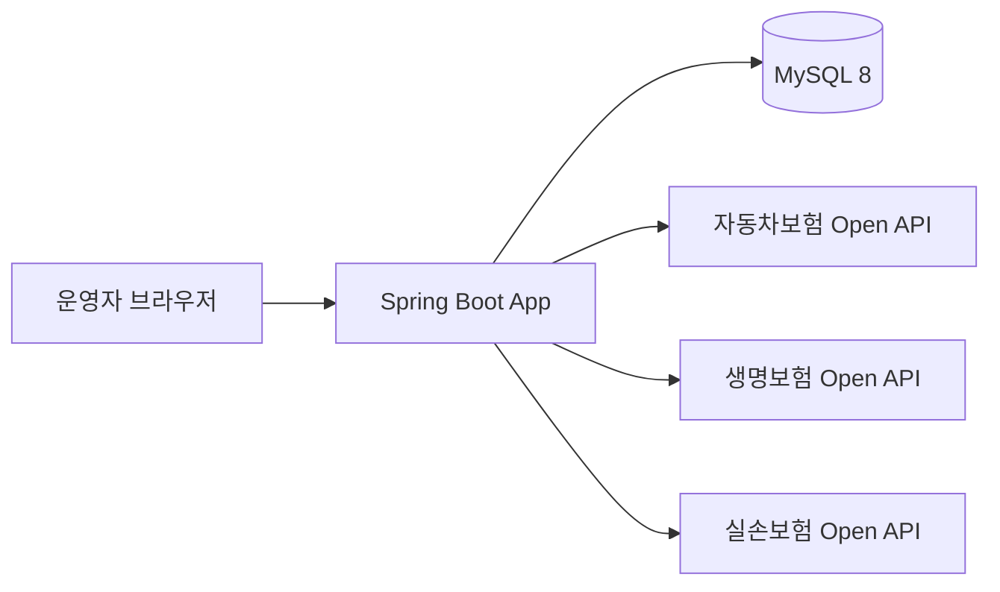
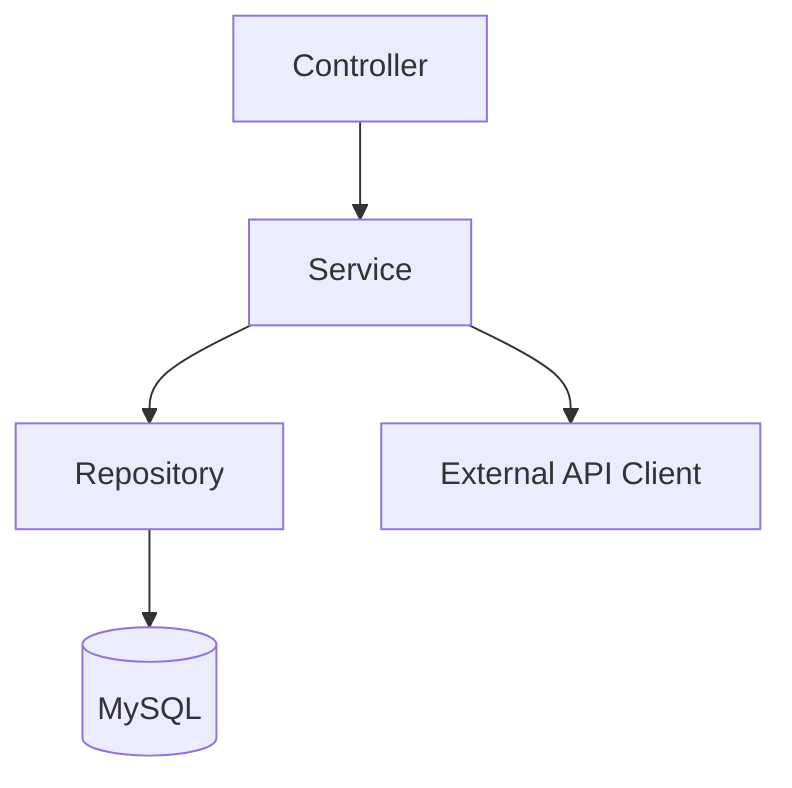
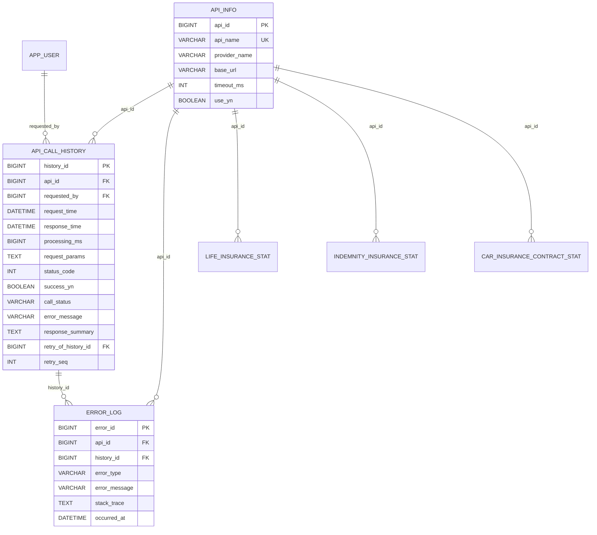
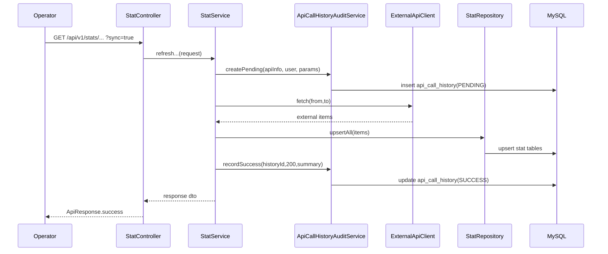
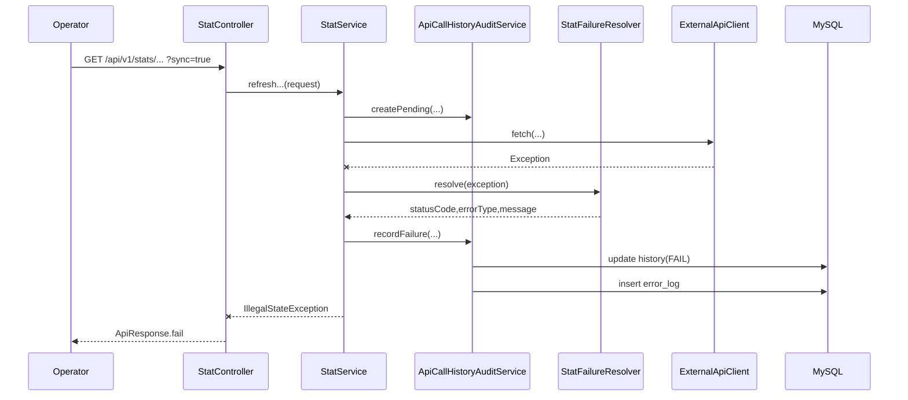

# 보험 외부 인터페이스 운영관리 시스템 설계도

## 1. 아키텍처 개요

본 시스템은 Layered Architecture를 따른다.

- Controller: 요청 검증/응답 반환
- Service: 업무 흐름 제어, 상태 전이
- Repository: 저장/조회 전담
- Client: 외부 API 통신 및 스펙 차이 흡수

## 2. 시스템 구성도

## 3. 레이어 설계

### 패키지 구조

- `domain/*/controller`
- `domain/*/service`
- `domain/*/repository`
- `domain/*/client`
- `domain/*/dto`
- `common/config`, `common/exception`, `common/response`

## 4. 핵심 도메인 모델

### 상태 값 설계

- `PENDING`: 호출 시작, 처리중
- `SUCCESS`: 정상 완료
- `FAIL`: 실패 완료
- `RETRY`: 재처리 표시 (데이터 모델 지원)

## 5. API 설계

### 인증/운영 API

- `POST /auth/login`
- `GET /auth/me`
- `GET /auth/csrf`
- `GET /dashboard/summary`
- `GET /history/recent`

### 통계 API (핵심)

- `GET /api/v1/stats/car-insurance/contracts`
  - query: `fromYm`, `toYm`, `sync`
- `GET /api/v1/stats/life-insurance/subscriptions`
  - query: `fromYear`, `toYear`, `sync`
- `GET /api/v1/stats/indemnity-insurance/subscriptions`
  - query: `fromYm`, `toYm`, `sync`

### 동작 원칙

- `sync=false`: DB 저장 데이터 조회
- `sync=true`: 외부 API 동기화 후 조회

## 6. 시퀀스 설계

### 6-1. 동기화 조회 성공 시나리오 (`sync=true`)

### 6-2. 동기화 조회 실패 시나리오

## 7. 외부 연동 설계

### 공통 처리

- `WebClient` 사용
- 서비스키 미설정 시 즉시 예외
- 응답 `resultCode != 00` 시 외부 API 오류 처리
- 파싱 실패/빈 응답/타임아웃 구분 가능한 메시지 구성

### API별 처리

- 자동차보험: 월 단위(`yyyyMM`) 페이지 순회 조회
- 생명보험: 연 단위(`yyyy`) 페이지 순회 조회
- 실손보험: 월 단위(`yyyyMM`) + 성별(M/F) 분해 저장

## 8. 데이터 정합성/성능 설계

### 정합성

- 통계 테이블 별 중복 방지 Unique Key 구성
- `upsert (on duplicate key update)`로 최신값 반영
- 호출 이력은 `REQUIRES_NEW` 트랜잭션으로 감사 로그 유실 최소화

### 성능

- 호출 이력 인덱스
  - `request_time`
  - `(success_yn, request_time)`
  - `(api_id, request_time)`
  - `(call_status, request_time)`
- 통계 테이블 검색/기간 인덱스 구성

## 9. 보안 설계

- 인증 방식: Session 기반
- 비밀번호 저장: BCrypt 해시
- 인가 정책
  - `/login`, `/auth/login`, Swagger 등 일부 공개
  - 나머지 요청은 인증 필수
- CSRF
  - Cookie 기반 CSRF 토큰 사용
  - 로그인 API는 예외 처리

## 10. 예외/로그 설계

- API 응답 포맷 통일: `ApiResponse<T>`
- 글로벌 예외 처리: `GlobalExceptionHandler`
- 실패 유형 분류: `ErrorType`
  - `TIMEOUT`, `CONNECTION`, `BAD_RESPONSE`, `BUSINESS`, `UNKNOWN`
- 민감정보(토큰, API Key) 로그 출력 금지 원칙

## 11. 현재 구현 범위와 확장 설계

### 현재 구현됨

- 외부 API 3종 통합 조회
- 호출 이력/실패 로그 저장
- 대시보드 요약
- 히스토리 조회
- 세션 로그인

### 데이터 모델은 준비됐으나 후속 구현 권장

- 실패 건 수동 재처리 API
- 실패 건 자동 재시도 스케줄러
- `RETRY` 상태 전이 자동화

## 12. 배포/실행 아키텍처

- 개발/과제 제출 기준: Docker Compose
  - `mysql` 컨테이너 (3307 -> 3306)
  - `app` 컨테이너 (8080)
- 환경변수 기반 설정
  - DB 접속 정보
  - 외부 API 서비스키 및 타임아웃

## 13. 테스트 전략

- Service 테스트: 통계/인증/대시보드/이력
- Controller 통합 테스트: 인증/통계/이력
- Client 테스트: 외부 응답 파싱 검증

핵심 검증 포인트:

- 기간 파라미터 검증
- `sync` 분기 동작
- 성공/실패 상태 전이
- 실패 시 history + error_log 동시 기록
