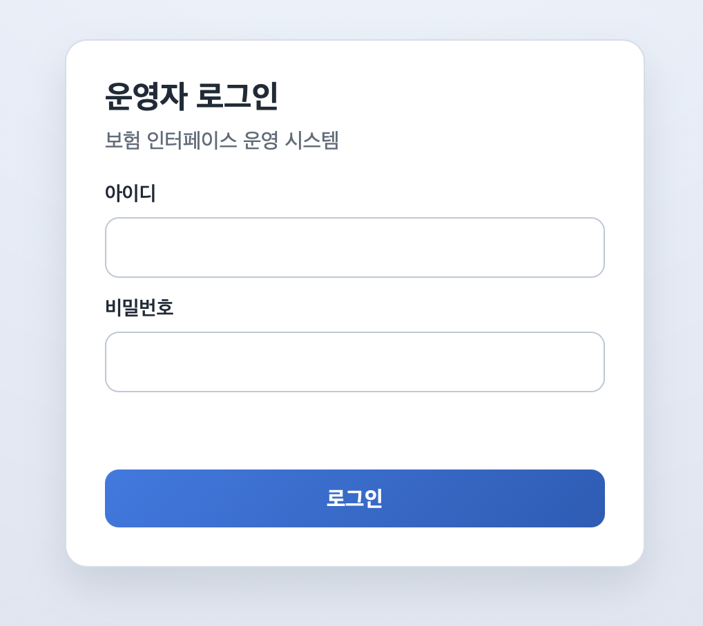
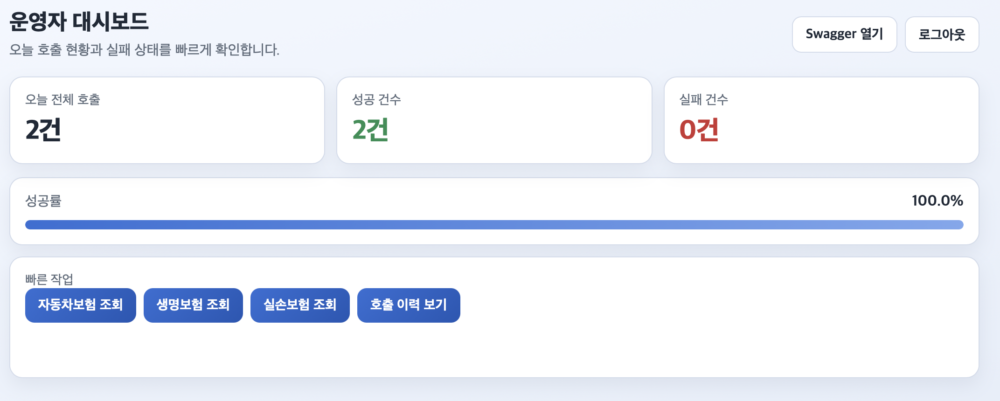
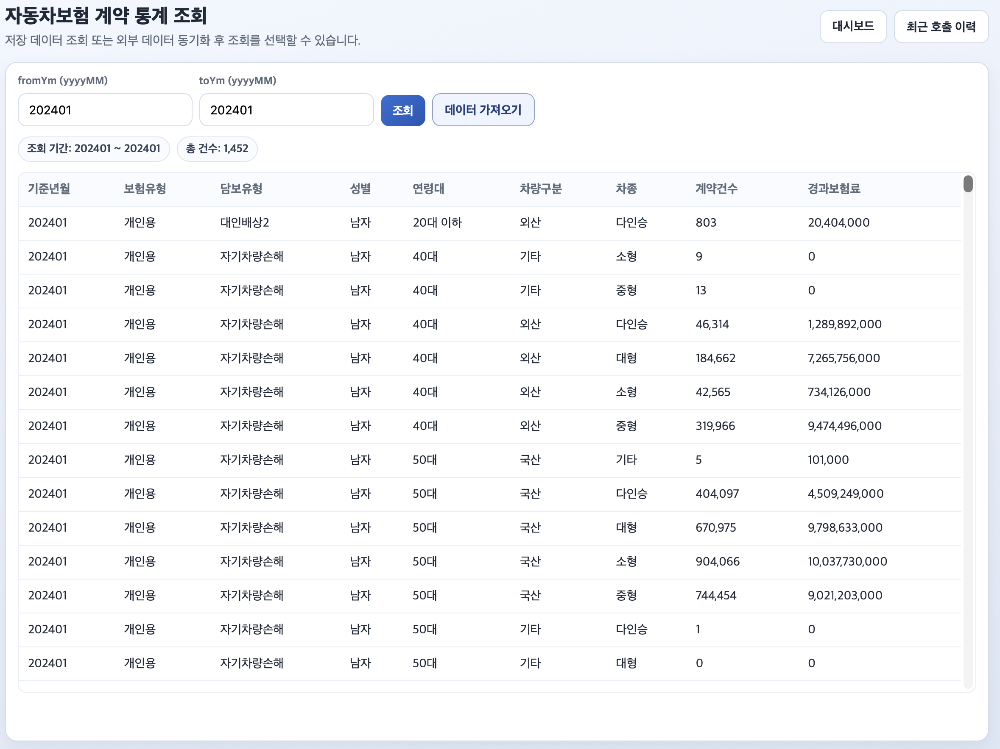
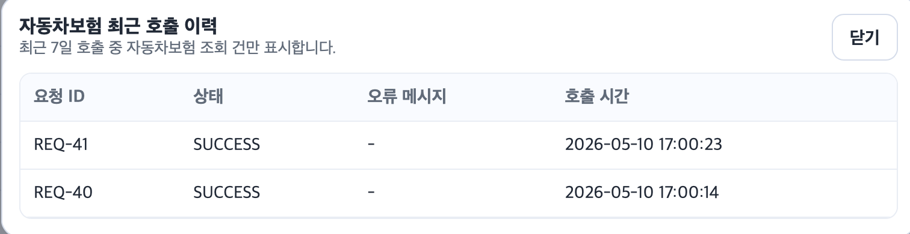
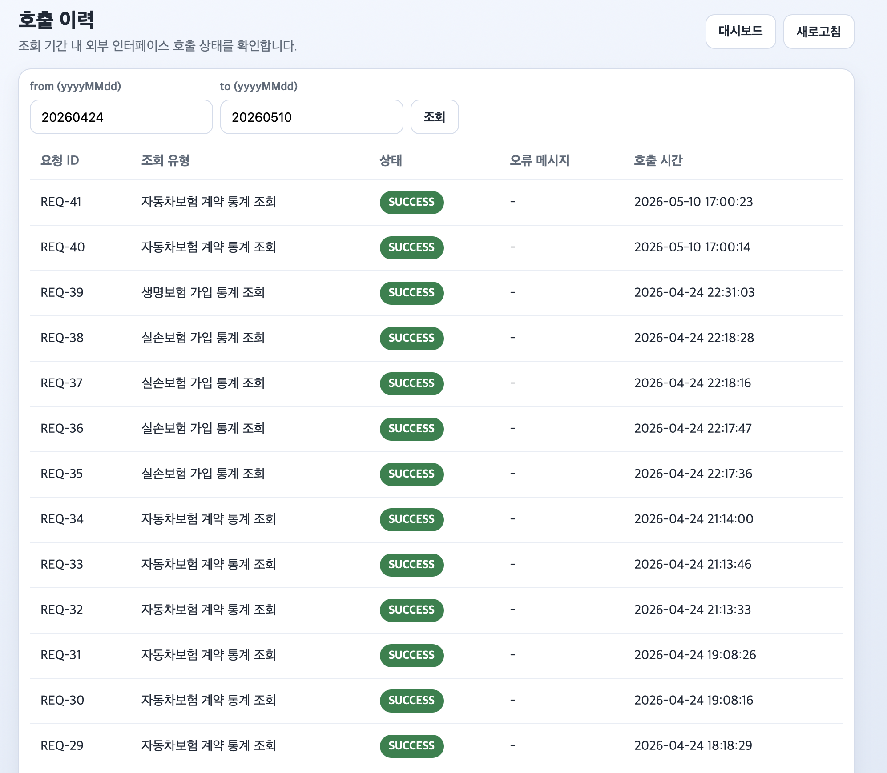

# 운영 화면 결과 문서

- 작성일: 2026-05-10
- 기준: 전달받은 결과 화면 캡처 5종

## 1. 화면 구성 요약

| 번호 | 화면명 | 경로 |
|---|---|---|
| 1 | 운영자 로그인 | `/login` |
| 2 | 운영자 대시보드 | `/dashboard` |
| 3 | 자동차보험 계약 통계 조회 | `/car-insurance` |
| 4 | 자동차보험 최근 호출 이력(모달) | `/car-insurance` 내 모달 |
| 5 | 호출 이력 | `/history` |

## 2. 결과 화면

### 2-1. 운영자 로그인

핵심 요소
- 아이디/비밀번호 입력
- 로그인 버튼
- 로그인 실패/안내 메시지 영역

### 2-2. 운영자 대시보드

핵심 요소
- 오늘 전체 호출, 성공 건수, 실패 건수
- 성공률(progress bar)
- 빠른 작업 버튼(자동차/생명/실손/호출이력)
- Swagger 열기, 로그아웃

### 2-3. 자동차보험 계약 통계 조회

핵심 요소
- 기간 조건(`fromYm`, `toYm`)
- `조회`(저장 데이터), `데이터 가져오기`(동기화 조회)
- 조회 기간/총 건수 요약칩
- 상세 통계 테이블(기준년월, 보험유형, 담보유형, 성별, 연령대, 차량구분, 차종, 계약건수, 경과보험료)

### 2-4. 자동차보험 최근 호출 이력 (모달)

핵심 요소
- 요청 ID, 상태, 오류 메시지, 호출 시간
- 닫기 버튼
- 최근 7일 기준 자동차보험 조회 건 필터 표시

### 2-5. 호출 이력

핵심 요소
- 조회 기간 조건(`from`, `to`)
- 요청 ID, 조회 유형, 상태, 오류 메시지, 호출 시간
- 상태 배지(`SUCCESS`, `FAIL`, `PENDING`, `RETRY`)
- 대시보드 이동, 새로고침

## 3. 관련 상세 문서

- 로그인/대시보드 상세: [SCREEN_SPEC_LOGIN_DASHBOARD.md](SCREEN_SPEC_LOGIN_DASHBOARD.md)
- 자동차보험 상세: [SCREEN_SPEC_CAR_INSURANCE.md](SCREEN_SPEC_CAR_INSURANCE.md)
- 호출 이력 상세: [SCREEN_SPEC_HISTORY.md](SCREEN_SPEC_HISTORY.md)
